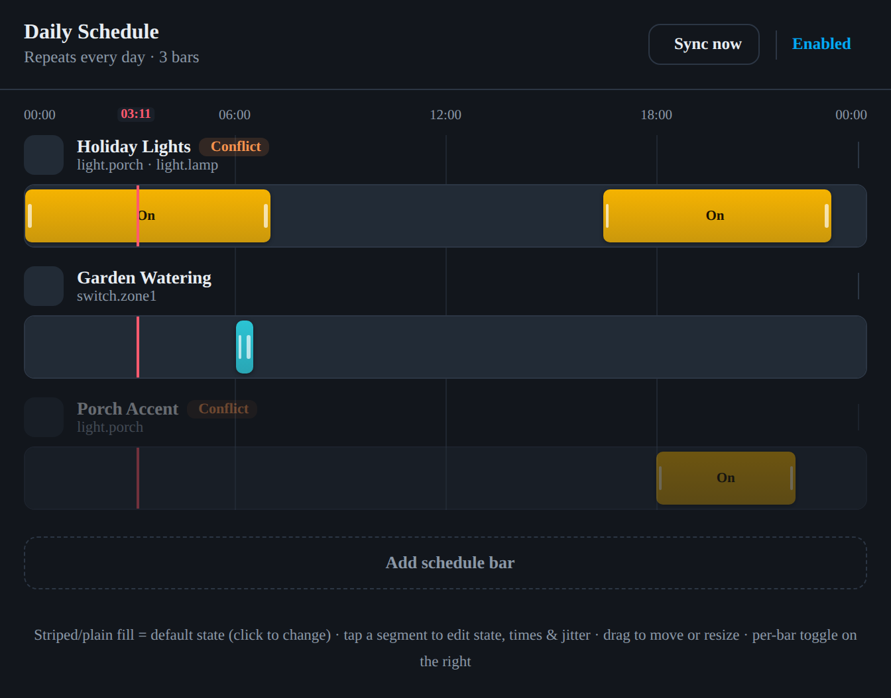

# Daily Schedule

A Home Assistant custom integration + Lovelace card for building a **repeating
24-hour schedule** that drives your entities. Divide the day into segments per
device — holiday light timers, garden watering, blind automation — with a
visual, drag-driven card. No YAML required for the common case.



> _Preview rendered from the card's test harness; Home Assistant renders the
> Material icons and toggles that the harness stubs out._

## Features

- **Visual day timeline.** Each device is a bar spanning midnight → midnight.
  Paint override **segments** on top of a **base** (default) state; drag to move
  or resize with 15-minute snapping and a live time bubble.
- **Boundary-driven engine.** Entities are switched exactly when the clock
  crosses a segment boundary — plus an automatic **state sync** at startup and
  after edits so the schedule is correct even if HA was restarted.
- **Sun-relative boundaries.** A segment's start or end can anchor to a solar
  event (**sunrise, sunset, dawn, dusk**) plus a ±2h offset — e.g.
  _sunset − 30m → 23:00_. Each boundary is independently a clock time or a solar
  anchor; the concrete time is resolved per day. A segment whose edges invert
  once resolved (e.g. _07:00 → sunrise_ when the sun is already up) simply
  doesn't run that day — so "on at 7am **unless the sun is already up**" works.
- **Jitter.** Randomise a segment's boundaries by ±5–30 min, re-rolled once per
  day and clamped so segments never reorder or overlap.
- **Conflict warnings.** If two enabled bars target the same entity with
  overlapping active segments, both show a ⚠ Conflict chip.
- **Per-schedule and per-bar enable** toggles, plus a `switch` entity and a
  `sync_now` service for automations.
- **Themed** with Home Assistant CSS variables (light/dark aware).

## Supported device types

| Type      | States                       | Services used                                    |
| --------- | ---------------------------- | ------------------------------------------------ |
| `light`   | Off / On                     | `light.turn_off` / `light.turn_on`               |
| `blind`   | Closed / Open                | `cover.close_cover` / `cover.open_cover`         |
| `water`   | Off / Watering               | `switch.turn_off` / `switch.turn_on`             |
| `fan`     | Off / Low / Med / High       | `fan.turn_off` / `fan.set_percentage`            |
| `switch`  | Off / On                     | `homeassistant.turn_off` / `homeassistant.turn_on` |
| `climate` | Off / On (+ mode, temp, fan) | `climate.turn_off` / `set_hvac_mode` + `set_temperature` + `set_fan_mode` |
| `media`   | Stopped / Play               | `media_player.media_stop` / `volume_set` + `play_media` |

`climate` and `media` carry **per-segment parameters** — a climate segment's
mode, target temperature and fan mode, or a media segment's source and volume —
edited in the segment popover and stored on the segment. A type declares these
via `param_schema` in the registry; the engine merges a segment's saved values
over the step's defaults when it fires the service call.

For `climate`, the **HVAC mode and fan mode lists are read from the target
entity's own `hvac_modes` / `fan_modes` attributes** — nothing is assumed. When
a bar targets several climate entities, only the modes they *all* support are
offered. Segments are coloured by mode.

`media` (and `climate`) show that a state can run a **sequence** of service
calls — for media, set the volume then play; for climate, set the mode,
temperature, then fan. A step whose required parameter is empty is skipped (e.g.
`set_fan_mode` when the unit has no fan modes). `targets` may list several
entities — a speaker group or a pair of heat pumps — with no special handling,
and each step only receives the parameters it declares.

### Stateless triggers

| Type      | Shape          | Fires                                         |
| --------- | -------------- | --------------------------------------------- |
| `trigger` | Trigger points | `scene.turn_on` / `script.turn_on` / `automation.trigger` |

A `trigger` bar has no base or on/off ranges. Instead you drop **trigger points**
on the timeline and drag them around; each fires an automation, scene or script
at its time (with optional jitter). Because a stateless bar holds no state, it
takes no startup sync — a point whose time already passed today does not fire
retroactively — and it is excluded from conflict detection. A type is stateless
when its registry entry sets `kind: "stateless"`; the card then renders pins
instead of a track, and the engine schedules a one-shot per point.

The mapping is data-driven (`custom_components/daily_schedule/const.py`), so new
device families can be added without touching the engine or the card.

## Installation

### HACS (recommended)

1. In HACS → **Integrations** → ⋮ → **Custom repositories**, add
   `https://github.com/tom-henderson/ha-scheduler` as an **Integration**.
2. Install **Daily Schedule** and restart Home Assistant.
3. Go to **Settings → Devices & Services → Add Integration → Daily Schedule**.

The Lovelace card is bundled with the integration and registered automatically —
there is no separate resource to add.

### Manual

1. Copy `custom_components/daily_schedule/` into your HA `config/custom_components/`.
2. Restart Home Assistant and add the **Daily Schedule** integration.

## Adding the card

Edit a dashboard → **Add card** → search for **Daily Schedule**, or add it in
YAML:

```yaml
type: custom:daily-schedule-card
# entry_id: <optional>   # only needed if you have more than one schedule
# title: Daily Schedule  # optional override
```

With a single Daily Schedule set up, the card auto-selects it.

## Using the card

- **Tap a segment** to edit its state, start/end times and jitter. Each
  **Start** and **End** toggles between **Clock** (HH:MM, validated) and **Sun**
  (pick sunrise/sunset/dawn/dusk and a ±offset; a "≈ HH:MM today" hint shows the
  resolved time). **Drag** the body to move it, or an edge to resize (clamped to
  its neighbours, 15-min minimum); solar edges show a sun marker and are edited
  in the popover rather than dragged.
- **Tap the base layer** (the fill behind the segments) to set the default
  state applied to all uncovered time.
- **+** adds a segment in the largest free gap and opens its editor.
- **⚙** edits the bar's name and target entities (standard HA entity picker).
- **Drag the ⠿ grip** on the left of a bar's header up or down to **reorder**
  bars. Order is presentational only — it doesn't affect scheduling.
- **Sync now** sets every entity to its current scheduled state on demand.

## Service

`daily_schedule.sync_now` — set every targeted entity to the state its schedule
defines for the current time (the same sync performed at startup).

| Field      | Required | Description                                             |
| ---------- | -------- | ------------------------------------------------------- |
| `entry_id` | no       | Sync a specific schedule. Omit to sync all schedules.   |

## How it works

```
Schedule (enabled) ── bars[] ── Bar (name, type, targets, base, enabled)
                                     └── segments[] ── Segment (start, end, state, jitter)
```

The state at any time is the covering segment's state, else the bar's `base`.
The engine schedules a timer at each transition for the day, re-rolling jitter
at midnight. A disabled schedule does nothing; a disabled bar is skipped.
Conflicts are surfaced as warnings only — v1 does not resolve them (last write
wins at runtime).

See [`HANDOVER.md`](HANDOVER.md) for the full functional specification.

## Development

Integration (Python):

```bash
pip install pytest-homeassistant-custom-component
pytest                     # 139 tests: engine, logic, CRUD, setup
```

Card (TypeScript / Lit):

```bash
cd card
npm install
npm run build              # bundles into custom_components/daily_schedule/frontend/
npm run lint               # tsc --noEmit
npx playwright test        # headless smoke tests of the rendered card
```

`npm run build` emits the card bundle directly into the integration, which
serves and auto-registers it as a frontend resource.

## License

[MIT](LICENSE)
